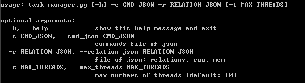
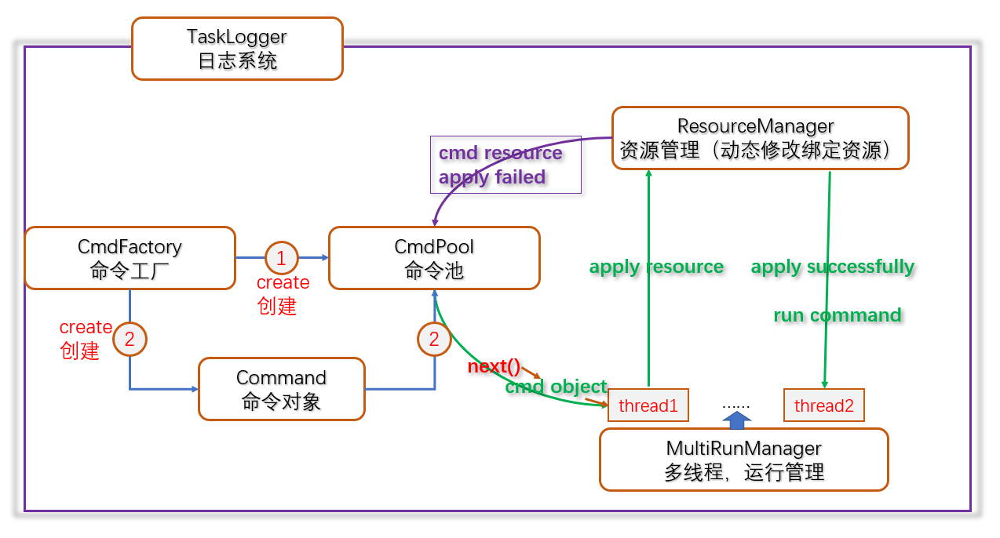
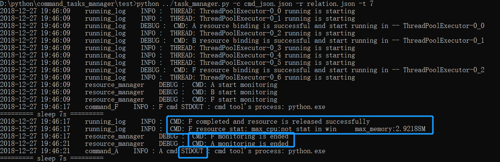

# command_tasks_manager
command_tasks_manager is a command(shell, cmd) tasks and resource management program

## 1.  task_manager program params description:

## 2. needed param example files:
### 2.1  [cmd_json.json](test/cmd_json.json)
### 2.2  [relation.json](test/relation.json)

## 3. program flow diagram

 
 ## 4. example of log
 
 